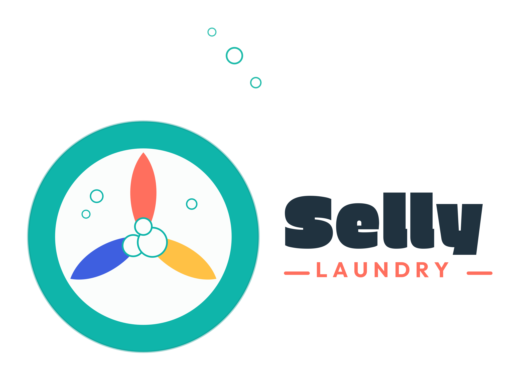

<div align="center">



# 🧺 Selly Laundry

### Aplikasi Manajemen Laundry Pickup & Delivery Berbasis Web

*Kelola pesanan, kurir, outlet, dan pelanggan laundry-mu — dari satu dashboard, real-time, dan bisa diinstal seperti aplikasi native.*

[](https://opensource.org/licenses/MIT)
[](https://laravel.com)
[](https://www.php.net)
[](https://livewire.laravel.com)
[](https://tailwindcss.com)

[](#-pwa-progressive-web-app)
[](#-role--hak-akses)
[](#-kontribusi)
[](#)

</div>

---

## 📑 Daftar Isi

- [🎯 Latar Belakang](#-latar-belakang)
- [✨ Fitur](#-fitur)
- [🎭 Role & Hak Akses](#-role--hak-akses)
- [🛠️ Tech Stack](#️-tech-stack)
- [🚀 Instalasi](#-instalasi)
- [🔑 Akun Demo](#-akun-demo)
- [📱 PWA](#-pwa-progressive-web-app)
- [🗂️ Struktur Data](#️-struktur-data)
- [🤝 Kontribusi](#-kontribusi)
- [📄 Lisensi](#-lisensi)
- [📬 Kontak](#-kontak)

---

## 🎯 Latar Belakang

Banyak usaha laundry masih mengelola pesanan secara manual lewat buku catatan atau chat WhatsApp, sehingga sulit untuk:

- 📦 Melacak status cucian pelanggan secara real-time (dijemput → dicuci → siap → diantar)
- 🛵 Mengatur jadwal & rute kurir pickup dan pengantaran
- 🏬 Mengelola banyak outlet/cabang dari satu tempat
- 💳 Mencatat pembayaran dan riwayat transaksi pelanggan
- 🎁 Menjalankan program loyalitas dan voucher promosi
- 👷 Mengelola data karyawan beserta gaji per outlet

> 💡 **Selly Laundry** hadir sebagai platform digital yang menghubungkan pelanggan, kurir, operator outlet, dan pemilik usaha dalam satu alur kerja yang rapi — bisa diakses dari HP, tablet, maupun komputer.

---

## ✨ Fitur

<div align="center">

| | | |
|:---:|:---:|:---:|
| 🛍️ **Katalog Layanan**<br>Kategori, harga, & modifier layanan cuci | 🛒 **Keranjang & Checkout**<br>Pilih layanan, atur jadwal jemput/antar | 📦 **Tracking Pesanan**<br>Status real-time tiap tahap proses |
| 🛵 **Manajemen Kurir**<br>Penugasan & daftar tugas pickup/antar | 🧑‍💼 **Panel Operator**<br>Papan kerja proses cucian per outlet | 🏬 **Multi Outlet/Cabang**<br>Kelola beberapa cabang sekaligus |
| 🎁 **Poin Loyalitas**<br>Reward otomatis untuk pelanggan setia | 🎟️ **Voucher & Promo**<br>Kode diskon dan banner promosi | 👷 **Karyawan & Gaji**<br>Data staf serta penggajian per outlet |
| 💳 **Riwayat Pembayaran**<br>Catatan transaksi tiap pesanan | ❓ **FAQ & Jam Outlet**<br>Info operasional untuk pelanggan | 📱 **PWA Ready**<br>Instal ke home screen seperti app native |

</div>

---

## 🎭 Role & Hak Akses

| Role | Ikon | Akses |
|:---:|:---:|---|
| **Owner** | 👑 | Dashboard bisnis, kategori, layanan, banner, cabang, FAQ, dan pegawai |
| **Outlet Admin** | 🏬 | Mengelola operasional outlet yang ditugaskan |
| **Operator** | 🧑‍🔧 | Memproses pesanan pada papan kerja outlet |
| **Kurir** | 🛵 | Menerima dan menyelesaikan tugas jemput/antar |
| **Customer** | 🙋 | Belanja layanan, checkout, lacak pesanan, poin & promo |

---

## 🛠️ Tech Stack

<div align="center">


</div>

| Teknologi | Kegunaan |
|---|---|
| [Laravel 13](https://laravel.com) | Framework backend (PHP) |
| [Livewire 4](https://livewire.laravel.com) | Komponen full-stack reaktif (frontend + backend menyatu) |
| [Tailwind CSS 4](https://tailwindcss.com) | Styling & desain responsif |
| [Vite](https://vitejs.dev) | Build tool asset frontend |
| MySQL / MariaDB | Database |

---

## 🚀 Instalasi

### Prasyarat


### Langkah

```bash
# Clone repositori
git clone https://github.com/zusfan-ops/laundry.git
cd laundry

# Install dependencies
composer install
npm install

# Konfigurasi environment
cp .env.example .env
php artisan key:generate
```

Atur koneksi database pada file `.env`:

```env
DB_CONNECTION=mysql
DB_HOST=127.0.0.1
DB_PORT=3306
DB_DATABASE=selly_laundry
DB_USERNAME=root
DB_PASSWORD=
```

```bash
# Migrasi database & seeder
php artisan migrate:fresh --seed

# Buat storage link
php artisan storage:link

# Build asset frontend
npm run build

# Jalankan server
php artisan serve
```

> ✅ Buka aplikasi di `http://127.0.0.1:8000`

---

## 🔑 Akun Demo

Setelah menjalankan `php artisan migrate:fresh --seed`, akun berikut tersedia untuk uji coba (password sama untuk semua): `password`

| Role | Email | Akses |
|:---:|---|---|
| 👑 Owner | `owner@selly.test` | Pemilik usaha (akses penuh) |
| 🏬 Outlet Admin | `admin@selly.test` | Admin cabang |
| 🧑‍🔧 Operator | `operator@selly.test` | Proses cucian outlet |
| 🛵 Kurir | `kurir@selly.test` | Tugas jemput & antar |
| 🙋 Customer | `rina@selly.test` | Pelanggan (dengan saldo poin loyalitas) |

---

## 📱 PWA (Progressive Web App)

Selly Laundry mendukung **PWA**. Buka melalui browser HP, lalu pilih **"Install App"** atau **"Add to Home Screen"** untuk menggunakannya seperti aplikasi native — lengkap dengan ikon dan tema warna khas Selly Laundry. 🚀

---

## 🗂️ Struktur Data

Entitas utama yang dikelola dalam sistem: `Outlet`, `Service` & `ServiceCategory` & `ServiceModifier`, `Order` & `OrderItem` & `OrderStatusLog`, `Courier` & `CourierAssignment`, `Payment`, `Address`, `Voucher` & `VoucherUsage`, `LoyaltyPoint`, `PromoBanner`, `TimeSlot`, `Salary`, `Faq`, `Notification`, dan `User` (dengan role `owner`, `outlet_admin`, `operator`, `courier`, `customer`).

---

## 🤝 Kontribusi

Selly Laundry dikembangkan secara terbuka dan mengundang kontribusi dari komunitas, khususnya:

🧑‍💻 Developer Laravel/PHP · 🎨 Frontend Developer (Tailwind, Livewire) · 🖌️ UI/UX Designer · 🧪 QA & Tester · 🧺 Pemilik usaha laundry dengan masukan fitur

**Cara berkontribusi:**

1. 🍴 Fork repositori ini
2. 🌿 Buat branch fitur: `git checkout -b fitur-keren`
3. 💾 Commit perubahan: `git commit -m 'Menambahkan fitur keren'`
4. 📤 Push ke branch: `git push origin fitur-keren`
5. 🔀 Buat Pull Request

---

## 📄 Lisensi

Didistribusikan di bawah [](https://opensource.org/licenses/MIT) — bebas digunakan, dimodifikasi, dan didistribusikan.

---

## 📬 Kontak

<div align="center">

### Zusfan Mashuri

[](https://hallosemarang.com)
[](https://zusfan.hallosemarang.com)
[](mailto:zusfan.mashuri@gmail.com)
[](https://wa.me/628998813000?text=Halo%2C%20saya%20ingin%20bertanya%20informasi%20terkait%20source%20code%20Selly%20Laundry%20ini.)

**⭐ Jangan lupa beri Star jika proyek ini bermanfaat! ⭐**

*Dibangun dengan ❤️ untuk usaha laundry Indonesia*

</div>
