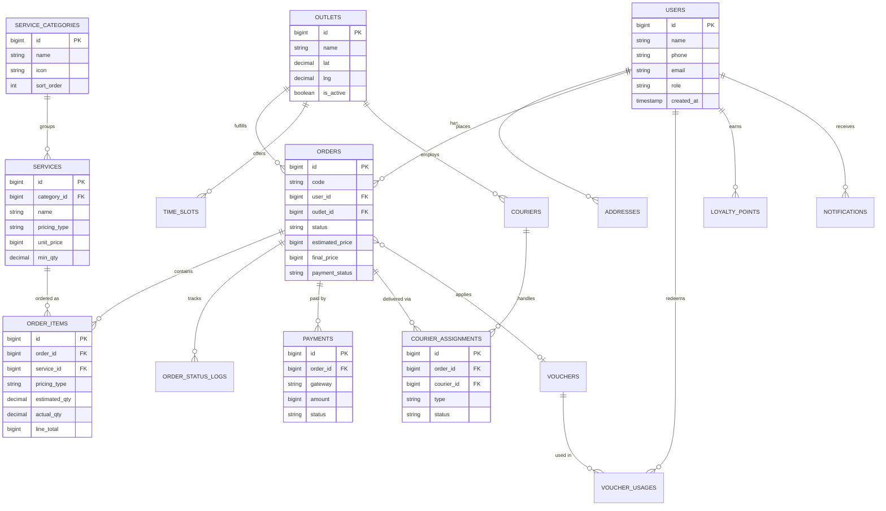

# Selly Laundry — Skema Database (ERD + DDL)

| | |
|---|---|
| **Database** | MySQL 8.x, InnoDB, `utf8mb4_unicode_ci` |
| **ORM** | Eloquent (Laravel 11/12) |
| **Versi** | 1.0 |

---

## 1. Konvensi

- **Primary key**: `BIGINT UNSIGNED AUTO_INCREMENT` (`id`). Tabel yang diakses publik (order) punya kolom `code` unik (`SLY-YYYYMMDD-XXXX`) untuk ditampilkan, bukan `id`.
- **Uang**: semua nominal `BIGINT UNSIGNED` dalam **rupiah penuh** (tanpa desimal). Tidak ada `FLOAT`/`DOUBLE` untuk uang.
- **Berat**: `DECIMAL(6,2)` dalam kilogram.
- **Timestamps**: `created_at`, `updated_at` (Laravel). Tabel penting pakai `deleted_at` (soft delete).
- **Multi-outlet**: tabel transaksional menyimpan `outlet_id`.
- **Audit**: kolom `*_by` (`created_by`, `processed_by`) menunjuk `users.id`.
- **Idempotency**: tabel order menyimpan `client_uuid` unik (untuk pembuatan dari klien offline).

---

## 2. ERD



---

## 3. DDL (MySQL)

### 3.1 users & roles

```sql
CREATE TABLE users (
  id              BIGINT UNSIGNED AUTO_INCREMENT PRIMARY KEY,
  name            VARCHAR(120) NOT NULL,
  phone           VARCHAR(20)  NULL,
  email           VARCHAR(150) NULL,
  password        VARCHAR(255) NULL,
  role            ENUM('customer','courier','operator','outlet_admin','owner') NOT NULL DEFAULT 'customer',
  outlet_id       BIGINT UNSIGNED NULL,            -- untuk staff yang terikat outlet
  loyalty_balance BIGINT UNSIGNED NOT NULL DEFAULT 0,
  push_token      VARCHAR(512) NULL,
  is_active       TINYINT(1) NOT NULL DEFAULT 1,
  email_verified_at TIMESTAMP NULL,
  phone_verified_at TIMESTAMP NULL,
  created_at      TIMESTAMP NULL,
  updated_at      TIMESTAMP NULL,
  deleted_at      TIMESTAMP NULL,
  UNIQUE KEY uq_users_phone (phone),
  UNIQUE KEY uq_users_email (email),
  KEY idx_users_role (role),
  KEY idx_users_outlet (outlet_id)
) ENGINE=InnoDB DEFAULT CHARSET=utf8mb4 COLLATE=utf8mb4_unicode_ci;
```

### 3.2 outlets

```sql
CREATE TABLE outlets (
  id            BIGINT UNSIGNED AUTO_INCREMENT PRIMARY KEY,
  name          VARCHAR(120) NOT NULL,
  phone         VARCHAR(20) NULL,
  address       VARCHAR(255) NULL,
  lat           DECIMAL(10,7) NULL,
  lng           DECIMAL(10,7) NULL,
  free_shipping_threshold BIGINT UNSIGNED NOT NULL DEFAULT 0,  -- 0 = nonaktif
  base_shipping_fee       BIGINT UNSIGNED NOT NULL DEFAULT 0,
  fee_per_km              BIGINT UNSIGNED NOT NULL DEFAULT 0,
  is_active     TINYINT(1) NOT NULL DEFAULT 1,
  created_at    TIMESTAMP NULL,
  updated_at    TIMESTAMP NULL,
  deleted_at    TIMESTAMP NULL
) ENGINE=InnoDB DEFAULT CHARSET=utf8mb4 COLLATE=utf8mb4_unicode_ci;
```

### 3.3 service_categories & services

```sql
CREATE TABLE service_categories (
  id          BIGINT UNSIGNED AUTO_INCREMENT PRIMARY KEY,
  name        VARCHAR(80) NOT NULL,
  icon        VARCHAR(80) NULL,          -- nama ikon (mis. ti-shirt)
  color       VARCHAR(20) NULL,          -- warna kartu kategori
  sort_order  INT NOT NULL DEFAULT 0,
  is_active   TINYINT(1) NOT NULL DEFAULT 1,
  created_at  TIMESTAMP NULL,
  updated_at  TIMESTAMP NULL
) ENGINE=InnoDB DEFAULT CHARSET=utf8mb4 COLLATE=utf8mb4_unicode_ci;

CREATE TABLE services (
  id            BIGINT UNSIGNED AUTO_INCREMENT PRIMARY KEY,
  category_id   BIGINT UNSIGNED NOT NULL,
  outlet_id     BIGINT UNSIGNED NULL,     -- NULL = berlaku global; isi untuk harga lokal
  name          VARCHAR(120) NOT NULL,
  description   VARCHAR(255) NULL,
  pricing_type  ENUM('weight','unit') NOT NULL,   -- kiloan vs satuan
  unit_price    BIGINT UNSIGNED NOT NULL,          -- per kg (weight) atau per item (unit)
  unit_label    VARCHAR(20) NOT NULL DEFAULT 'kg', -- 'kg' atau 'pcs'
  min_qty       DECIMAL(6,2) NOT NULL DEFAULT 0,   -- minimum (mis. 3 kg)
  est_duration_hours INT NOT NULL DEFAULT 48,
  is_active     TINYINT(1) NOT NULL DEFAULT 1,
  created_at    TIMESTAMP NULL,
  updated_at    TIMESTAMP NULL,
  deleted_at    TIMESTAMP NULL,
  CONSTRAINT fk_services_category FOREIGN KEY (category_id) REFERENCES service_categories(id),
  CONSTRAINT fk_services_outlet   FOREIGN KEY (outlet_id)   REFERENCES outlets(id),
  KEY idx_services_pricing (pricing_type)
) ENGINE=InnoDB DEFAULT CHARSET=utf8mb4 COLLATE=utf8mb4_unicode_ci;
```

### 3.4 service_modifiers (tier kecepatan, parfum, treatment)

```sql
CREATE TABLE service_modifiers (
  id           BIGINT UNSIGNED AUTO_INCREMENT PRIMARY KEY,
  type         ENUM('speed','perfume','treatment') NOT NULL,
  name         VARCHAR(80) NOT NULL,        -- 'Express', 'Reguler', 'Lavender'
  multiplier   DECIMAL(4,2) NOT NULL DEFAULT 1.00,  -- untuk speed
  flat_fee     BIGINT UNSIGNED NOT NULL DEFAULT 0,  -- untuk parfum/treatment
  is_active    TINYINT(1) NOT NULL DEFAULT 1,
  created_at   TIMESTAMP NULL,
  updated_at   TIMESTAMP NULL
) ENGINE=InnoDB DEFAULT CHARSET=utf8mb4 COLLATE=utf8mb4_unicode_ci;
```

### 3.5 addresses

```sql
CREATE TABLE addresses (
  id          BIGINT UNSIGNED AUTO_INCREMENT PRIMARY KEY,
  user_id     BIGINT UNSIGNED NOT NULL,
  label       VARCHAR(40) NULL,            -- 'Rumah', 'Kantor'
  recipient   VARCHAR(120) NULL,
  phone       VARCHAR(20) NULL,
  full_address TEXT NOT NULL,
  notes       VARCHAR(255) NULL,
  lat         DECIMAL(10,7) NULL,
  lng         DECIMAL(10,7) NULL,
  is_default  TINYINT(1) NOT NULL DEFAULT 0,
  created_at  TIMESTAMP NULL,
  updated_at  TIMESTAMP NULL,
  deleted_at  TIMESTAMP NULL,
  CONSTRAINT fk_addresses_user FOREIGN KEY (user_id) REFERENCES users(id),
  KEY idx_addresses_user (user_id)
) ENGINE=InnoDB DEFAULT CHARSET=utf8mb4 COLLATE=utf8mb4_unicode_ci;
```

### 3.6 time_slots

```sql
CREATE TABLE time_slots (
  id          BIGINT UNSIGNED AUTO_INCREMENT PRIMARY KEY,
  outlet_id   BIGINT UNSIGNED NOT NULL,
  start_time  TIME NOT NULL,
  end_time    TIME NOT NULL,
  capacity    INT NOT NULL DEFAULT 10,     -- maksimum order per slot
  is_active   TINYINT(1) NOT NULL DEFAULT 1,
  created_at  TIMESTAMP NULL,
  updated_at  TIMESTAMP NULL,
  CONSTRAINT fk_slots_outlet FOREIGN KEY (outlet_id) REFERENCES outlets(id),
  KEY idx_slots_outlet (outlet_id)
) ENGINE=InnoDB DEFAULT CHARSET=utf8mb4 COLLATE=utf8mb4_unicode_ci;
```

### 3.7 orders (tabel inti)

```sql
CREATE TABLE orders (
  id                BIGINT UNSIGNED AUTO_INCREMENT PRIMARY KEY,
  code              VARCHAR(30) NOT NULL,           -- SLY-20260609-0042
  client_uuid       CHAR(36) NULL,                  -- idempotency dari klien
  user_id           BIGINT UNSIGNED NOT NULL,
  outlet_id         BIGINT UNSIGNED NOT NULL,
  address_id        BIGINT UNSIGNED NOT NULL,

  status            ENUM(
                      'pending_payment','placed','assigned_pickup','picked_up',
                      'at_outlet','weighed','awaiting_price_confirm','processing',
                      'ready','assigned_delivery','delivering','completed','cancelled'
                    ) NOT NULL DEFAULT 'placed',

  -- harga
  estimated_subtotal BIGINT UNSIGNED NOT NULL DEFAULT 0,
  final_subtotal     BIGINT UNSIGNED NOT NULL DEFAULT 0,
  shipping_fee       BIGINT UNSIGNED NOT NULL DEFAULT 0,
  discount_amount    BIGINT UNSIGNED NOT NULL DEFAULT 0,
  estimated_total    BIGINT UNSIGNED NOT NULL DEFAULT 0,
  final_total        BIGINT UNSIGNED NOT NULL DEFAULT 0,

  -- berat
  estimated_weight   DECIMAL(6,2) NULL,
  actual_weight      DECIMAL(6,2) NULL,

  -- jadwal
  pickup_slot_id     BIGINT UNSIGNED NULL,
  delivery_slot_id   BIGINT UNSIGNED NULL,
  pickup_date        DATE NULL,
  delivery_date      DATE NULL,

  -- pembayaran & promo
  payment_mode       ENUM('prepaid_estimate','pay_after_weigh') NOT NULL DEFAULT 'pay_after_weigh',
  payment_status     ENUM('unpaid','pending','paid','refunded','partial') NOT NULL DEFAULT 'unpaid',
  voucher_id         BIGINT UNSIGNED NULL,

  notes              VARCHAR(255) NULL,
  rating             TINYINT UNSIGNED NULL,          -- 1..5
  review             VARCHAR(500) NULL,

  created_by         BIGINT UNSIGNED NULL,
  created_at         TIMESTAMP NULL,
  updated_at         TIMESTAMP NULL,
  deleted_at         TIMESTAMP NULL,

  UNIQUE KEY uq_orders_code (code),
  UNIQUE KEY uq_orders_client_uuid (client_uuid),
  CONSTRAINT fk_orders_user   FOREIGN KEY (user_id)   REFERENCES users(id),
  CONSTRAINT fk_orders_outlet FOREIGN KEY (outlet_id) REFERENCES outlets(id),
  CONSTRAINT fk_orders_addr   FOREIGN KEY (address_id) REFERENCES addresses(id),
  KEY idx_orders_status (status),
  KEY idx_orders_user (user_id),
  KEY idx_orders_outlet_status (outlet_id, status)
) ENGINE=InnoDB DEFAULT CHARSET=utf8mb4 COLLATE=utf8mb4_unicode_ci;
```

### 3.8 order_items (snapshot harga)

```sql
CREATE TABLE order_items (
  id            BIGINT UNSIGNED AUTO_INCREMENT PRIMARY KEY,
  order_id      BIGINT UNSIGNED NOT NULL,
  service_id    BIGINT UNSIGNED NOT NULL,
  service_name  VARCHAR(120) NOT NULL,       -- snapshot nama
  pricing_type  ENUM('weight','unit') NOT NULL,
  unit_price    BIGINT UNSIGNED NOT NULL,     -- snapshot harga saat order
  speed_multiplier DECIMAL(4,2) NOT NULL DEFAULT 1.00,
  perfume_fee   BIGINT UNSIGNED NOT NULL DEFAULT 0,
  estimated_qty DECIMAL(6,2) NULL,            -- kg atau pcs
  actual_qty    DECIMAL(6,2) NULL,
  line_total    BIGINT UNSIGNED NOT NULL DEFAULT 0,  -- dihitung dari actual bila ada
  created_at    TIMESTAMP NULL,
  updated_at    TIMESTAMP NULL,
  CONSTRAINT fk_items_order   FOREIGN KEY (order_id)   REFERENCES orders(id) ON DELETE CASCADE,
  CONSTRAINT fk_items_service FOREIGN KEY (service_id) REFERENCES services(id),
  KEY idx_items_order (order_id)
) ENGINE=InnoDB DEFAULT CHARSET=utf8mb4 COLLATE=utf8mb4_unicode_ci;
```

> **Penting:** `service_name`, `unit_price`, dan modifier disimpan sebagai *snapshot* di `order_items`, bukan join langsung ke `services`. Harga layanan bisa berubah, tapi nilai pada order historis harus tetap.

### 3.9 order_status_logs (audit trail)

```sql
CREATE TABLE order_status_logs (
  id          BIGINT UNSIGNED AUTO_INCREMENT PRIMARY KEY,
  order_id    BIGINT UNSIGNED NOT NULL,
  from_status VARCHAR(40) NULL,
  to_status   VARCHAR(40) NOT NULL,
  actor_id    BIGINT UNSIGNED NULL,        -- siapa yang memicu
  actor_role  VARCHAR(20) NULL,
  note        VARCHAR(255) NULL,
  photo_path  VARCHAR(255) NULL,           -- bukti foto (pickup/delivery)
  lat         DECIMAL(10,7) NULL,
  lng         DECIMAL(10,7) NULL,
  client_uuid CHAR(36) NULL,               -- idempotency aksi kurir offline
  created_at  TIMESTAMP NULL,
  CONSTRAINT fk_logs_order FOREIGN KEY (order_id) REFERENCES orders(id) ON DELETE CASCADE,
  UNIQUE KEY uq_logs_client_uuid (client_uuid),
  KEY idx_logs_order (order_id)
) ENGINE=InnoDB DEFAULT CHARSET=utf8mb4 COLLATE=utf8mb4_unicode_ci;
```

### 3.10 payments

```sql
CREATE TABLE payments (
  id              BIGINT UNSIGNED AUTO_INCREMENT PRIMARY KEY,
  order_id        BIGINT UNSIGNED NOT NULL,
  gateway         ENUM('midtrans','xendit','cash') NOT NULL,
  external_id     VARCHAR(120) NULL,        -- order_id/transaction_id di gateway
  amount          BIGINT UNSIGNED NOT NULL,
  type            ENUM('charge','refund','difference') NOT NULL DEFAULT 'charge',
  status          ENUM('pending','paid','failed','expired','refunded') NOT NULL DEFAULT 'pending',
  method          VARCHAR(40) NULL,         -- 'qris','gopay','va_bca', dst
  paid_at         TIMESTAMP NULL,
  raw_payload     JSON NULL,                -- payload webhook untuk audit
  created_at      TIMESTAMP NULL,
  updated_at      TIMESTAMP NULL,
  CONSTRAINT fk_payments_order FOREIGN KEY (order_id) REFERENCES orders(id),
  KEY idx_payments_order (order_id),
  KEY idx_payments_status (status)
) ENGINE=InnoDB DEFAULT CHARSET=utf8mb4 COLLATE=utf8mb4_unicode_ci;
```

### 3.11 couriers & courier_assignments

```sql
CREATE TABLE couriers (
  id          BIGINT UNSIGNED AUTO_INCREMENT PRIMARY KEY,
  user_id     BIGINT UNSIGNED NOT NULL,
  outlet_id   BIGINT UNSIGNED NOT NULL,
  vehicle     VARCHAR(40) NULL,
  is_available TINYINT(1) NOT NULL DEFAULT 1,
  last_lat    DECIMAL(10,7) NULL,
  last_lng    DECIMAL(10,7) NULL,
  created_at  TIMESTAMP NULL,
  updated_at  TIMESTAMP NULL,
  CONSTRAINT fk_couriers_user   FOREIGN KEY (user_id)   REFERENCES users(id),
  CONSTRAINT fk_couriers_outlet FOREIGN KEY (outlet_id) REFERENCES outlets(id)
) ENGINE=InnoDB DEFAULT CHARSET=utf8mb4 COLLATE=utf8mb4_unicode_ci;

CREATE TABLE courier_assignments (
  id          BIGINT UNSIGNED AUTO_INCREMENT PRIMARY KEY,
  order_id    BIGINT UNSIGNED NOT NULL,
  courier_id  BIGINT UNSIGNED NOT NULL,
  type        ENUM('pickup','delivery') NOT NULL,
  status      ENUM('assigned','on_the_way','arrived','done','failed') NOT NULL DEFAULT 'assigned',
  proof_photo VARCHAR(255) NULL,
  assigned_at TIMESTAMP NULL,
  done_at     TIMESTAMP NULL,
  created_at  TIMESTAMP NULL,
  updated_at  TIMESTAMP NULL,
  CONSTRAINT fk_assign_order   FOREIGN KEY (order_id)   REFERENCES orders(id),
  CONSTRAINT fk_assign_courier FOREIGN KEY (courier_id) REFERENCES couriers(id),
  KEY idx_assign_order (order_id),
  KEY idx_assign_courier_status (courier_id, status)
) ENGINE=InnoDB DEFAULT CHARSET=utf8mb4 COLLATE=utf8mb4_unicode_ci;
```

### 3.12 vouchers, voucher_usages, loyalty_points

```sql
CREATE TABLE vouchers (
  id            BIGINT UNSIGNED AUTO_INCREMENT PRIMARY KEY,
  code          VARCHAR(40) NOT NULL,
  type          ENUM('percent','fixed','free_shipping') NOT NULL,
  value         BIGINT UNSIGNED NOT NULL DEFAULT 0,   -- persen (0-100) atau nominal
  min_order     BIGINT UNSIGNED NOT NULL DEFAULT 0,
  max_discount  BIGINT UNSIGNED NULL,
  quota         INT NULL,                              -- total kuota; NULL = tak terbatas
  per_user_limit INT NOT NULL DEFAULT 1,
  starts_at     TIMESTAMP NULL,
  ends_at       TIMESTAMP NULL,
  is_active     TINYINT(1) NOT NULL DEFAULT 1,
  created_at    TIMESTAMP NULL,
  updated_at    TIMESTAMP NULL,
  UNIQUE KEY uq_vouchers_code (code)
) ENGINE=InnoDB DEFAULT CHARSET=utf8mb4 COLLATE=utf8mb4_unicode_ci;

CREATE TABLE voucher_usages (
  id          BIGINT UNSIGNED AUTO_INCREMENT PRIMARY KEY,
  voucher_id  BIGINT UNSIGNED NOT NULL,
  user_id     BIGINT UNSIGNED NOT NULL,
  order_id    BIGINT UNSIGNED NOT NULL,
  discount    BIGINT UNSIGNED NOT NULL,
  created_at  TIMESTAMP NULL,
  CONSTRAINT fk_vu_voucher FOREIGN KEY (voucher_id) REFERENCES vouchers(id),
  CONSTRAINT fk_vu_user    FOREIGN KEY (user_id)    REFERENCES users(id),
  CONSTRAINT fk_vu_order   FOREIGN KEY (order_id)   REFERENCES orders(id),
  KEY idx_vu_user (user_id)
) ENGINE=InnoDB DEFAULT CHARSET=utf8mb4 COLLATE=utf8mb4_unicode_ci;

CREATE TABLE loyalty_points (
  id          BIGINT UNSIGNED AUTO_INCREMENT PRIMARY KEY,
  user_id     BIGINT UNSIGNED NOT NULL,
  order_id    BIGINT UNSIGNED NULL,
  type        ENUM('earn','redeem','expire','adjust') NOT NULL,
  points      BIGINT NOT NULL,                 -- bisa negatif untuk redeem
  balance_after BIGINT NOT NULL,
  note        VARCHAR(255) NULL,
  created_at  TIMESTAMP NULL,
  CONSTRAINT fk_lp_user FOREIGN KEY (user_id) REFERENCES users(id),
  KEY idx_lp_user (user_id)
) ENGINE=InnoDB DEFAULT CHARSET=utf8mb4 COLLATE=utf8mb4_unicode_ci;
```

### 3.13 notifications

```sql
CREATE TABLE notifications (
  id          BIGINT UNSIGNED AUTO_INCREMENT PRIMARY KEY,
  user_id     BIGINT UNSIGNED NOT NULL,
  order_id    BIGINT UNSIGNED NULL,
  channel     ENUM('push','whatsapp','email') NOT NULL,
  title       VARCHAR(120) NOT NULL,
  body        VARCHAR(255) NOT NULL,
  is_read     TINYINT(1) NOT NULL DEFAULT 0,
  sent_at     TIMESTAMP NULL,
  created_at  TIMESTAMP NULL,
  CONSTRAINT fk_notif_user FOREIGN KEY (user_id) REFERENCES users(id),
  KEY idx_notif_user_read (user_id, is_read)
) ENGINE=InnoDB DEFAULT CHARSET=utf8mb4 COLLATE=utf8mb4_unicode_ci;
```

---

## 4. Catatan implementasi Eloquent

- Gunakan **cast** `integer` untuk kolom uang dan helper accessor untuk format rupiah di tampilan; jangan simpan terformat.
- `Order::booted()` mengisi `code` & `client_uuid` saat membuat. Validasi transisi `status` lewat service/state-machine (lihat `SELLY_LAUNDRY_WORKFLOW.md`), bukan langsung `->update(['status' => ...])`.
- Selalu catat ke `order_status_logs` di dalam transaksi yang sama saat status berubah.
- Slot penuh: cek `COUNT(orders WHERE pickup_slot_id = ? AND pickup_date = ?) < time_slots.capacity` dalam transaksi dengan lock (`lockForUpdate`) untuk hindari overbooking.
- Indeks komposit `(outlet_id, status)` mempercepat board operator.
