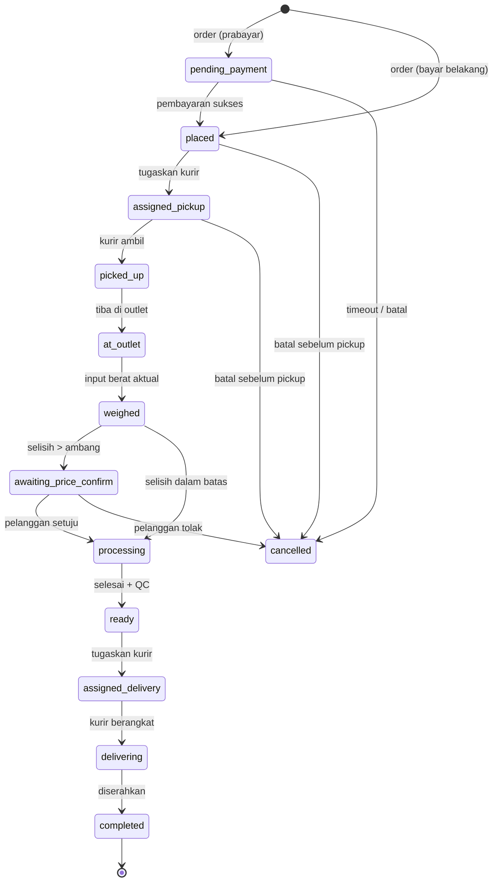
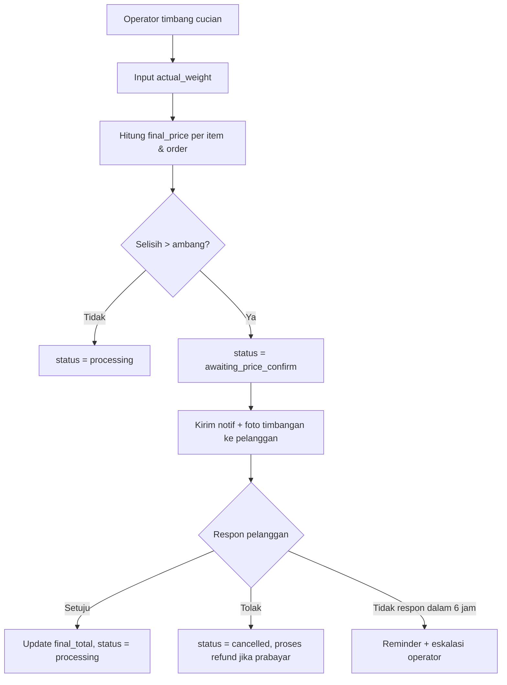
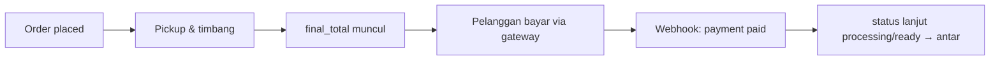
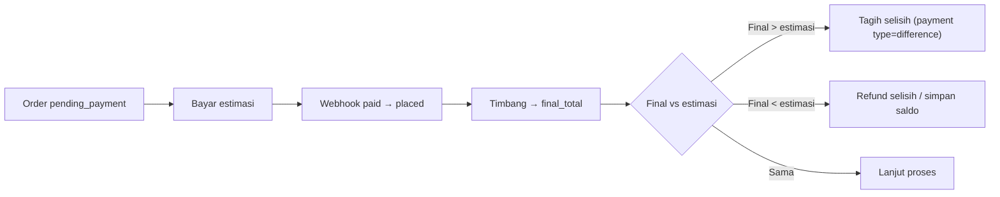
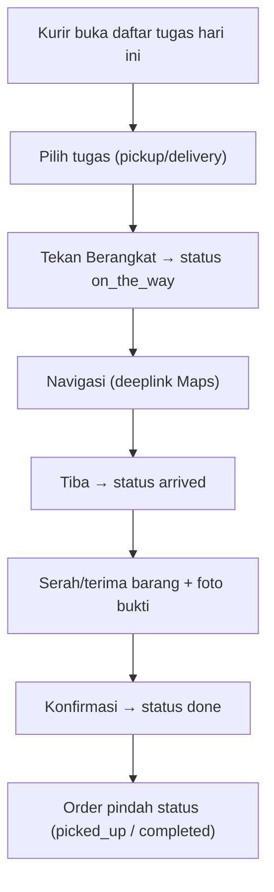

# Selly Laundry — Workflow & State Machine

| | |
|---|---|
| **Versi** | 1.0 |
| **Cakupan** | Order lifecycle, penimbangan & konfirmasi harga, pembayaran, pickup/delivery, pembatalan/refund, notifikasi, idempotency offline |

---

## 1. Status order & transisi

### 1.1 Daftar status

| Status | Arti | Pemicu | Aktor |
|---|---|---|---|
| `pending_payment` | Menunggu bayar (mode prabayar) | Order dibuat, belum dibayar | system |
| `placed` | Order diterima sistem | Order dibuat (mode bayar-belakang) / setelah bayar | customer/system |
| `assigned_pickup` | Kurir ditugaskan menjemput | Penugasan kurir | outlet_admin/system |
| `picked_up` | Cucian sudah dijemput | Kurir konfirmasi ambil | courier |
| `at_outlet` | Tiba di outlet | Kurir serahkan / operator terima | operator |
| `weighed` | Sudah ditimbang | Operator input berat aktual | operator |
| `awaiting_price_confirm` | Menunggu konfirmasi harga | Selisih berat > ambang | system |
| `processing` | Sedang dicuci/setrika | Operator mulai proses | operator |
| `ready` | Selesai, siap diantar | Operator selesai + QC | operator |
| `assigned_delivery` | Kurir ditugaskan mengantar | Penugasan kurir | outlet_admin/system |
| `delivering` | Sedang diantar | Kurir berangkat | courier |
| `completed` | Selesai diterima pelanggan | Kurir konfirmasi serah / customer terima | courier/customer |
| `cancelled` | Dibatalkan | Pembatalan | customer/admin |

### 1.2 Diagram transisi (Mermaid)



### 1.3 Aturan transisi (guard)

- Transisi hanya boleh mengikuti diagram. Transisi ilegal ditolak server-side (lempar `InvalidTransitionException`).
- Setiap transisi **wajib** menulis `order_status_logs` (from, to, actor, waktu) dalam transaksi yang sama.
- `weighed → processing` langsung hanya jika `|actual_weight − estimated_weight|` di bawah ambang konfigurasi (`weight_tolerance`, default 0,5 kg atau 20%).
- `awaiting_price_confirm` punya timeout (mis. 6 jam). Jika tak ada respon, kirim reminder; jika tetap, eskalasi ke operator (jangan auto-cancel uang pelanggan).
- `cancelled` hanya diizinkan sebelum `processing`. Setelah proses dimulai, pembatalan butuh persetujuan admin.

---

## 2. Sub-flow penimbangan & konfirmasi harga

Ini bagian paling kritikal untuk layanan kiloan.



**Perhitungan harga final per item:**

```
line_total = round_up(actual_qty × unit_price × speed_multiplier) + perfume_fee
```

`final_subtotal` = Σ `line_total`; `final_total` = `final_subtotal` + `shipping_fee` − `discount_amount`.

Saat menimbang, operator **wajib** mengunggah foto timbangan (disimpan di `order_status_logs.photo_path`) sebagai bukti, mengurangi sengketa.

---

## 3. Alur pembayaran

### 3.1 Mode bayar setelah ditimbang (disarankan kiloan)



### 3.2 Mode prabayar estimasi



### 3.3 Penanganan webhook

- Endpoint webhook memverifikasi **signature** gateway sebelum memproses.
- Webhook **idempoten**: gunakan `external_id` untuk mencegah pemrosesan ganda.
- Update `payments.status` dan `orders.payment_status` dalam satu transaksi; picu transisi status order bila relevan.
- Status pembayaran yang bisa diterima publik hanya dari webhook server-to-server, bukan dari redirect klien.

---

## 4. Alur kurir (pickup & delivery)



- Posisi kurir dikirim periodik (mis. tiap 15–30 dtk saat tugas aktif) ke server dan dipancarkan via Laravel Reverb ke layar tracking pelanggan.
- Pickup gagal (pelanggan tidak ada) → `failed`, kurir catat alasan, outlet menjadwalkan ulang.

---

## 5. Idempotency & mode offline kurir

Kurir sering berada di area sinyal buruk. Untuk mencegah aksi ganda:

1. Setiap aksi kurir (update status, unggah bukti) menghasilkan `client_uuid` di perangkat saat dibuat, **sebelum** dikirim.
2. Aksi disimpan di antrean lokal (IndexedDB) jika offline.
3. Saat online, antrean dikirim; server menolak `client_uuid` yang sudah pernah diproses (UNIQUE pada `order_status_logs.client_uuid`), mengembalikan hasil yang sama.
4. Foto bukti diunggah dengan retry; referensi disimpan setelah upload sukses.

```
POST /api/courier/assignments/{id}/complete
{ "client_uuid": "…", "lat": …, "lng": …, "photo_id": "…" }
→ jika client_uuid sudah ada: 200 + state terakhir (tidak diproses ulang)
```

---

## 6. Alur pembatalan & refund

| Kondisi | Aturan |
|---|---|
| Batal sebelum `picked_up` | Diizinkan otomatis; jika prabayar, refund penuh |
| Batal saat `awaiting_price_confirm` (pelanggan tolak harga) | Diizinkan; refund penuh bila prabayar; cucian dikembalikan (jadwalkan delivery balik) |
| Batal setelah `processing` | Butuh persetujuan admin; potongan biaya proses mungkin berlaku |
| Refund | Catat `payments` baru `type=refund`; sesuaikan saldo/poin bila perlu |

---

## 7. Matriks notifikasi

| Event | Kanal | Penerima | Isi |
|---|---|---|---|
| Order dibuat | push + WhatsApp | customer | Order `code` diterima, ringkasan |
| Kurir ditugaskan pickup | push | customer | Kurir dalam perjalanan menjemput |
| Cucian dijemput | push | customer | Cucian sudah diambil |
| Sudah ditimbang | push + WhatsApp | customer | Berat aktual & harga final |
| Butuh konfirmasi harga | push + WhatsApp | customer | Selisih harga, minta persetujuan |
| Pembayaran sukses | push + email | customer | Struk pembayaran |
| Mulai proses | push | customer | Cucian sedang diproses |
| Siap diantar | push | customer | Cucian selesai |
| Kurir mengantar | push | customer | Estimasi tiba |
| Selesai | push + email | customer | Terima kasih + minta rating |
| Order baru di outlet | push | operator/outlet_admin | Order masuk |
| Tugas baru | push | courier | Pickup/delivery baru |

Semua notif dicatat di tabel `notifications`. Pelanggan dapat mengatur preferensi kanal (kecuali OTP & konfirmasi harga yang selalu dikirim).

---

## 8. Job & queue (Laravel)

- `AssignCourierJob` — penugasan kurir (otomatis terdekat/round-robin).
- `SendNotificationJob` — kirim push/WA/email (queued, dengan retry).
- `ExpireUnpaidOrdersJob` (scheduled) — batalkan `pending_payment` yang melewati TTL.
- `PriceConfirmReminderJob` (scheduled) — reminder `awaiting_price_confirm`.
- `RecalculateSlotCapacityJob` — bila perlu, untuk dashboard kapasitas.

Gunakan koneksi queue `redis` untuk throughput, dan `database` untuk job penting agar tahan restart.
